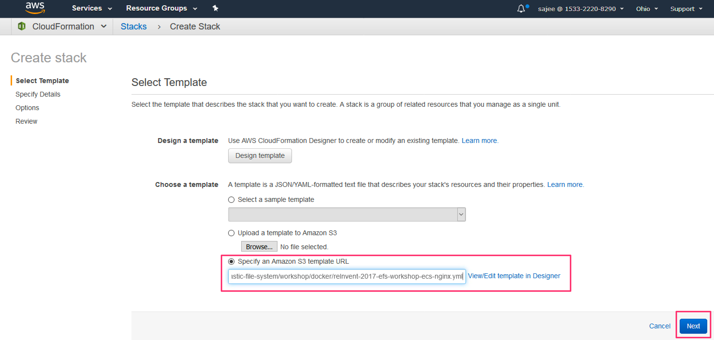
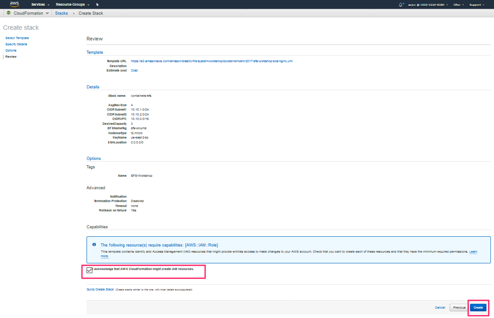
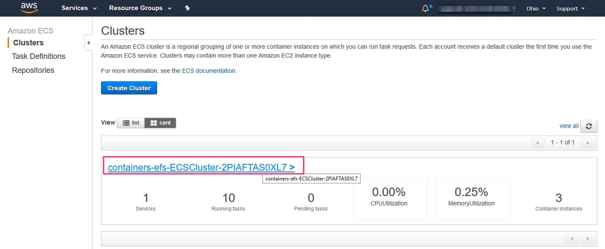
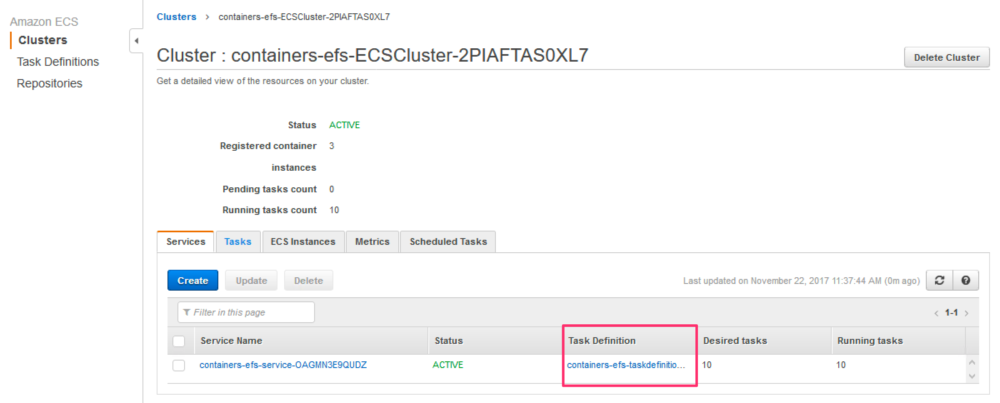
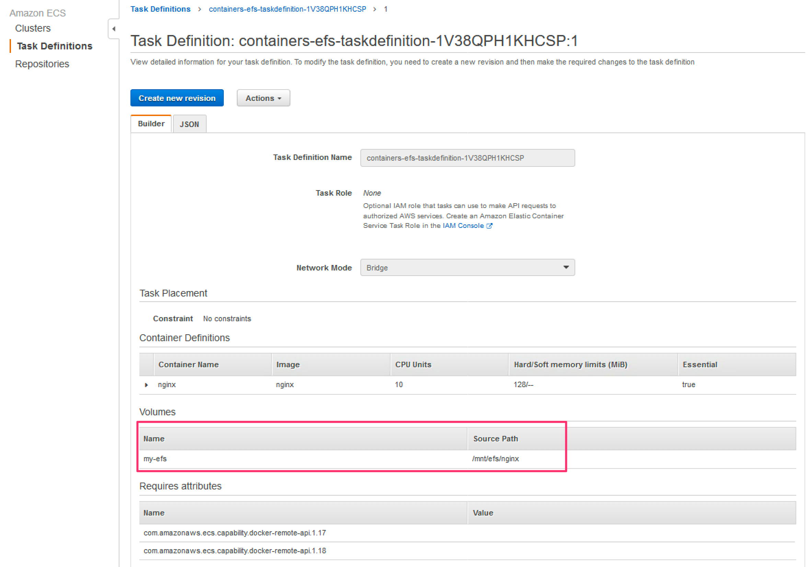
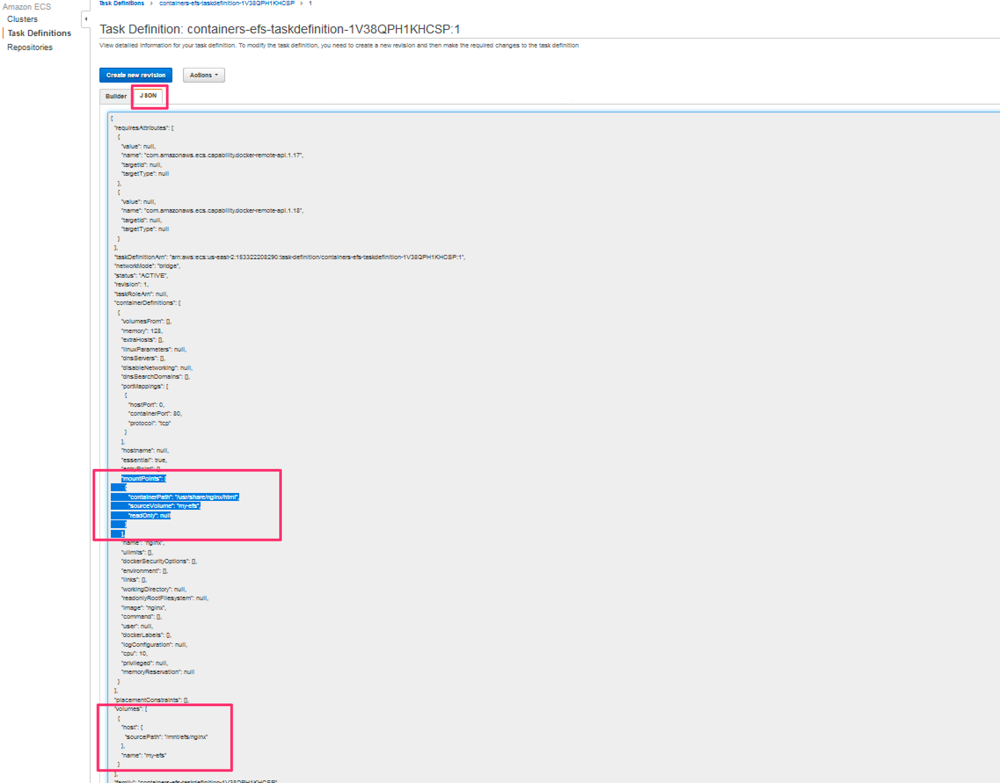
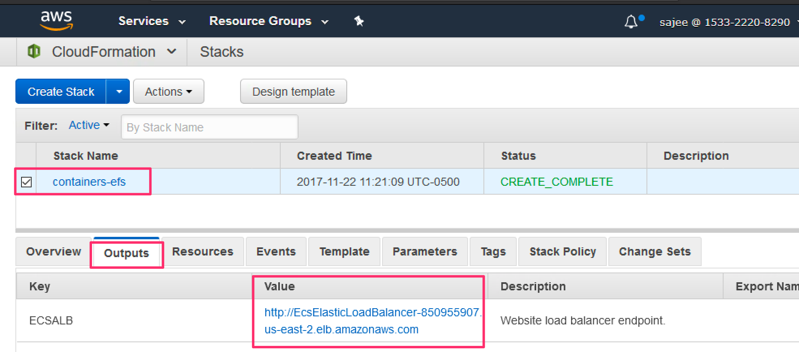
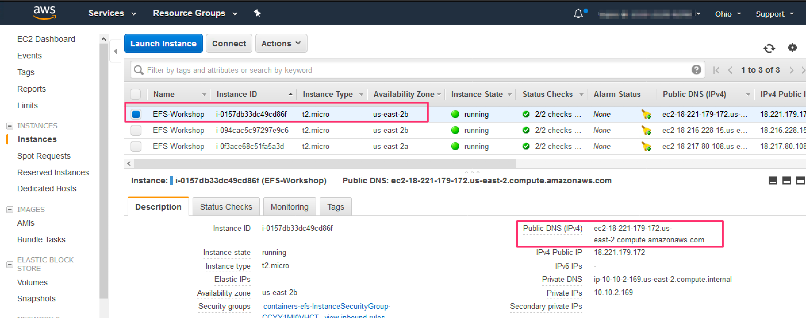
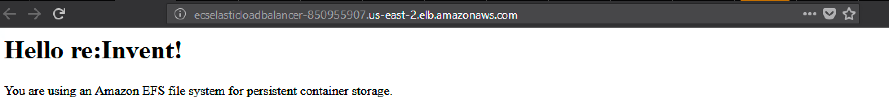

STG321 Amazon EFS: Leverage the Power of a Distributed Shared File System in the Cloud
======================================================================================

**EFS ReInvent Lab:** Using Amazon EFS to Persist Data from Amazon ECS
Containers

Approx. time to complete: **30 minutes**

Getting Started
---------------

Docker containers are intended to be stateless. Data written to a container's
filesystem will be lost once a container terminates. Therefore, important data
must be persisted outside a container, such as a volume on the host running the
container, a database, Amazon S3, etc. In this lab, we will look at how Amazon
EFS can be used for persistent container storage. As you've heard, EFS is a
highly-available, high performance file system for content management systems
that store and serve information for a range of applications like web sites,
home directories, online publications, and archives. It’s a great option for
external container storage.

In this lab, several Nginx web server containers will share a simple web
directory hosted on EFS. The benefit is that a single filesystem can be shared
across thousands of containers. The assets that represent a web application can
be updated in a single place, the EFS directory shared by the containers and the
update will be available to all containers. This simplifies deploying code
changes greatly

CloudFormation will deploy all of the components required for the lab. The Nginx
containers will run on several EC2 instances and will be fronted by an
Application Load Balancer (ALB). These components will be managed by EC2
Container Service (ECS). The instances will run inside a VPC that has subnets
that span two Availability Zones.

**Disclaimer:** To make the lab easier, we use permissive security policies,
which should not be used in any real environment. Additionally, we've narrowed
the configuration options (such as the range of available EC2 instances), to
cost optimize the lab.

Prerequisites
-------------

-   An AWS account with administrative level access

-   This lab must be run in one of the following AWS regions:

    -   US East (Ohio, us-east-2)

    -   US East (N. Virginia, us-east-1)

    -   US West (Oregon, us-west-2)

    -   EU (Frankfurt, eu-central-1),

    -   EU (Ireland eu-west-1)

    -   Asia Pacific (Sydney, ap-southeast-2)

    -   If you don't have a preference, choose either the Oregon or Ohio
        regions. The examples in this lab use the Ohio region.

Launch the lab
==============

1.  If you don’t already have an AWS account, [create
    one](https://portal.aws.amazon.com/billing/signup?nc2=h_ct&redirect_url=https%3A%2F%2Faws.amazon.com%2Fregistration-confirmation#/start)
    by following the on-screen instructions.

2.  You will receive a \$25 credit to cover the cost of this lab. You can apply
    the credit [here](https://console.aws.amazon.com/billing/home?#/credits).
    Remember to delete this lab at the end of this workshop, otherwise costs
    will accrue.

3.  Create a [key
    pair](https://us-east-2.console.aws.amazon.com/ec2/v2/home?region=us-east-2#KeyPairs:sort=keyName),
    by clicking on the **Create Key Pair** button.

    1.  Provide a name for the key pair.

    2.  When prompted, save the key pair to disk. You will need this later.

4.  Go to [the CloudFormation page in the us-east-2 (Ohio)
    region](https://us-east-2.console.aws.amazon.com/cloudformation/home?region=us-east-2#/stacks).


5.  Choose Create Stack and in the Choose a template section, enter this in the
    **Specify an Amazon S3 template URL** textbox:
    https://s3.amazonaws.com/amazon-elastic-file-system/workshop/docker/reInvent-2017-efs-workshop-ecs-nginx.yml



6.  On the next page, keep the default parameters, except:

    1.  Provide a value for **Stack name**. This can be anything you want, such
        as *containers-efs*.

    2.  For the **KeyName** field, choose the key pair that you created earlier.

    3.  Click **Next.**


7.  On the next page, in the Tags section, add:

    1.  **Key**: Name

    2.  **Value**: EFS Workshop [or use something more descriptive]


8.  Keep the rest unchanged, and click **Next**.

9.  On the next page, at the bottom, check “**I acknowledge that AWS
    CloudFormation might create IAM resources.”**



10.  Click Create. This stack will take about 10 minutes to create.

11.  The status will say **CREATE_IN_PROGRESS**. Once complete, the status will
    be **CREATE_COMPLETE**.


Figure 1. Stack creation in progress.


Figure 2. Stack creation complete.

While the lab is building, let’s preview what will happen next. Upon stack
completion, several Nginx containers will be running. The Nginx home directories
will be mapped to an EFS volume. The volume will be empty therefore when you
visit the site, you will see a HTTP error. To fix that, you will add a simple
*index.html* file and the Nginx containers will serve that. If you change the
contents of *index.html*, the changes are available to the containers instantly.

Explore the lab
===============

Proceed once the stack status says **CREATE_COMPLETE.**

1.  The CloudFormation template created the EFS filesystem and mounted them on
    the EC2 container instances. But how do the containers gain access to the
    EFS filesystem? Let’s look at the linkage between the containers and EFS.
    [Go to the ECS
    page](https://us-east-2.console.aws.amazon.com/ecs/home?region=us-east-2#/clusters)
    and click on your ECS cluster. Your cluster name should look something like
    this.



2.  The cluster details should show 10 containers running. You can view the
    containers that are running by clicking on the **Tasks** tab. Click on the
    **Task Definition** to view the details of the container configuration.



3.  The Builder view, in the Volumes section will show that there’s a volume
    available to the containers called *my-efs*. This volume is mounted on the
    EC2 instances running the containers at /mnt/efs/nginx.



4.  In the JSON view, we can see where the **my-efs** volume is mounted on the
    containers.

```  
"mountPoints": [
 {
   "containerPath": "/usr/share/nginx/html",
   "sourceVolume": "my-efs",
   "readOnly": null
}
]
```


And that’s how the containers are configured to use EFS. If you’re
interested in learning how EFS was initially created and connected to the underlying EC2 instances, you can see the details in the CloudFormation template, which is available in the Template tab on the [CloudFormation page](https://us-east-2.console.aws.amazon.com/cloudformation/home?region=us-east-2#/stacks?filter=active&tab=template).

5.  Now let’s access the Nginx containers. [Go to the CloudFormation
    page](https://us-east-2.console.aws.amazon.com/cloudformation/home?region=us-east-2#/stacks?filter=active&tab=template),
    select our stack and click on the Outputs tab. It will display a link to the
    load balancer that fronts all the Nginx containers. Click on the link.



6.  When your browser visits the link, you will see the error *“503 Service
    Temporarily Unavailable”*. This is because the EFS directory used as the
    home directory by the Nginx containers is empty. Nginx can’t find the root
    document, so it displays an error. Let’s fix this by connecting to an EC2
    instance and adding a index.html file to the EFS directory.

7.  [From the EC2
    page](https://us-east-2.console.aws.amazon.com/ec2/v2/home?region=us-east-2#Instances:sort=instanceId),
    select any one of the EC2 instance launched by our CloudFormation template.
    Copy the public DNS of the instance.



8.  SSH to the instance.

    1.  Be sure to substitute the path to your PEM file (the one that was
        downloaded earlier when you created your keypair). Preface the hostname
        with **ec2-user\@.** For Mac and Linux users, the command should look
        similar to this:

        1.  ssh -i /path/to/us-east-2-kp.pem
            [ec2-user\@ec2-18-221-179-172.us-east-2.compute.amazonaws.com](file:///\\WorkDocs\amazon\My%20Documents\WorkDocs\EFS-Workshop\ec2-user@ec2-18-221-179-172.us-east-2.compute.amazonaws.com)

    2.  For Windows users, follow the instructions for your preferred SSH app.
        If you don’t have a SSH app, [see this
        page](http://docs.aws.amazon.com/AWSEC2/latest/UserGuide/putty.html).

9.  Once connected to an instance, we will create a simple index.html file in
    the /mnt/efs/nginx directory that Nginx can serve. Normally, we would do
    this by using an editor like vim or nano. But the EC2 container instances
    we’re using are running a compact version of Amazon Linux that’s optimized
    for Docker containers and don’t have those programs. So let’s improvise and
    create the file via copying and pasting this command into your SSH session:
```
sudo bash -c "cat >/mnt/efs/nginx/index.html" <<'EOF'
<html>
    <body>
        <h1>Hello re:Invent!</h1>
        <p>You are using an Amazon EFS file system for persistent container storage.</p>
    </body>
</html>
EOF
```
10.  Navigate to the load balancer page again and you should see something like
    this.



11.  If you change the file, you will see the changes are picked up immediately
    by all containers.
```
sudo bash -c "cat >/mnt/efs/nginx/index.html" <<'EOF'
<html>
    <body>
        <h1>Hello re:Invent!</h1>
        <p>Your containers are using an Amazon EFS file system for persistent container storage.</p>
    </body>
</html>
EOF
```
Conclusion
==========

As you saw, EFS make it very simple to share data amongst multiple containers.
In this lab, the containers read the data but they also could have easily
written any data to EFS. In practice, production containers are embedded with
the code they need. But depending on the workload, EFS makes it easy for
multiple containers to access shared data. Containers can also produce valuable
data that needs to be persisted beyond the lifetime of the container. EFS is a
good option for containers to store that data.

Delete the CloudFormation Stack
===============================

Once you’re done with this lab, be sure to delete it. You can do this easily via
the **Delete Stack** action in the [CloudFormation
page](https://us-east-2.console.aws.amazon.com/cloudformation/home?region=us-east-2#/stacks?filter=active&tab=outputs).


