# **Amazon Elastic File System (Amazon EFS)**

## Using Amazon EFS to Persist Data from Amazon ECS Containers

### Version 1.0.1

efs-dr-1.0.1

---

© 2017 Amazon Web Services, Inc. and its affiliates. All rights reserved. This work may not be  reproduced or redistributed, in whole or in part, without prior written permission from Amazon Web Services, Inc. Commercial copying, lending, or selling is prohibited.

---

Approx. time to complete: **30 minutes**

Getting Started
---------------

Amazon Elastic File System (Amazon EFS) provides simple, scalable file storage for use with Amazon EC2 instances. With Amazon EFS, storage capacity is elastic, growing and shrinking automatically as you add and remove files. Your applications can have the storage they need, when they need it. You can use Amazon EFS file systems with Amazon ECS to export file system data across your fleet of Docker container instances. That way, your tasks have access to the same persistent storage, no matter the instance on which they land.

Docker containers tend to be stateless. Data written to a container's
filesystem will be lost once a container terminates. Therefore, important data
must be persisted outside a container, such as a volume on the container host, a database, Amazon S3, etc. In this lab, we will look at how
EFS can be used for persistent container storage.

In this lab, several Apache web servers containers will share PHP code on an EFS web
directory. The benefit is that a single filesystem can be shared
across potentially thousands of containers. The assets that represent a web application can
be updated in a single place making the update available to all containers. This
can simplify deploying code changes.

CloudFormation will deploy all of the components required for the lab. The
Apache containers will run on several EC2 instances and will be fronted by an
Application Load Balancer (ALB). These components will be managed by EC2
Container Service (ECS). The instances will run inside a VPC that has subnets
that span two Availability Zones.

**Disclaimer:** To make the lab easier, it uses permissive security policies,
which should not be used in any real environment. Additionally, we've narrowed
the configuration options (such as the range of available EC2 instances), to
cost optimize the lab.

Prerequisites
-------------

-   An AWS account with administrative level access

-   This lab must be run in one of the following AWS regions:

    -   US East (Ohio, us-east-2)

    -   US East (N. Virginia, us-east-1)

    -   US West (Oregon, us-west-2)

    -   EU (Frankfurt, eu-central-1),

    -   EU (Ireland eu-west-1)

    -   Asia Pacific (Sydney, ap-southeast-2)

    -   If you don't have a preference, choose either the Oregon or Ohio
        regions. The examples in this lab use the Ohio region.

Launch the lab
==============

1.  If you don’t already have an AWS account, [create
    one](https://portal.aws.amazon.com/billing/signup?nc2=h_ct&redirect_url=https%3A%2F%2Faws.amazon.com%2Fregistration-confirmation#/start)
    by following the on-screen instructions.

2.  You will receive a \$25 credit to cover the cost of this lab. You can apply
    the credit [here](https://console.aws.amazon.com/billing/home?#/credits).
    Remember to delete this lab at the end of this workshop, otherwise costs
    will accrue.

3.  Create a [key
    pair](https://us-east-2.console.aws.amazon.com/ec2/v2/home?region=us-east-2#KeyPairs:sort=keyName),
    by clicking on the **Create Key Pair** button.

    1.  Provide a name for the key pair.

    2.  When prompted, save the key pair to disk. You will need this later.

4.  Go to [the CloudFormation page in the us-east-2 (Ohio)
    region](https://us-east-2.console.aws.amazon.com/cloudformation/home?region=us-east-2#/stacks).

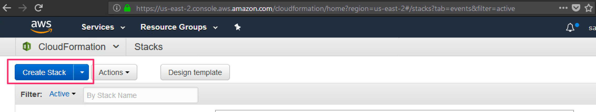

5.  Choose **Create Stack** and in the **Choose a template** section, enter this in the
    **Specify an Amazon S3 template URL** textbox:
    https://s3.amazonaws.com/amazon-elastic-file-system/workshop/docker/reInvent-2017-efs-workshop-ecs-php.yml

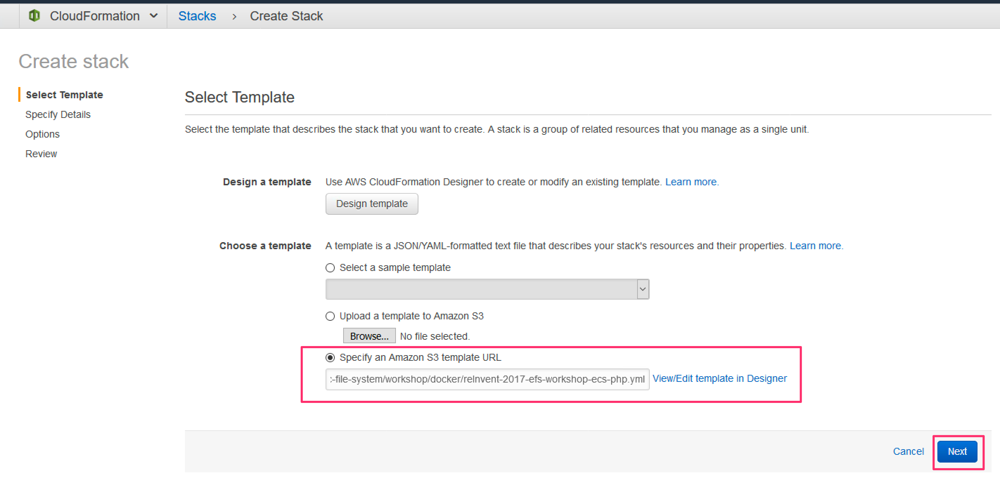

6.  On the next page, keep the default parameters, except:

    1.  Provide a value for **Stack name**. This can be anything you want, such
        as *containers-efs*.

    2.  For the **KeyName** field, choose the key pair that you created earlier.

    3.  Click **Next**.

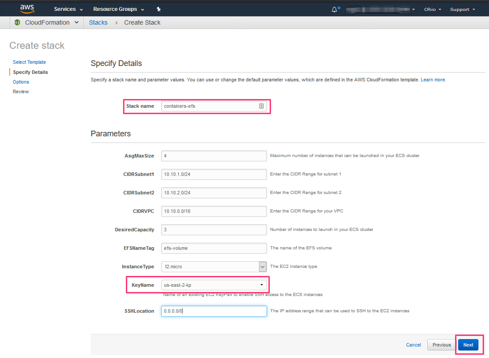

7.  On the next page, in the Tags section, add:

    1.  **Key**: Name

    2.  **Value**: EFS Workshop [or use something more descriptive]

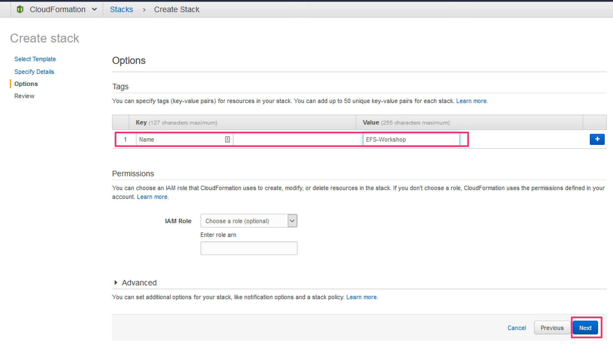

8.  Keep the rest unchanged, and click **Next**.

9.  On the next page, at the bottom, check “**I acknowledge that AWS
    CloudFormation might create IAM resources.”**

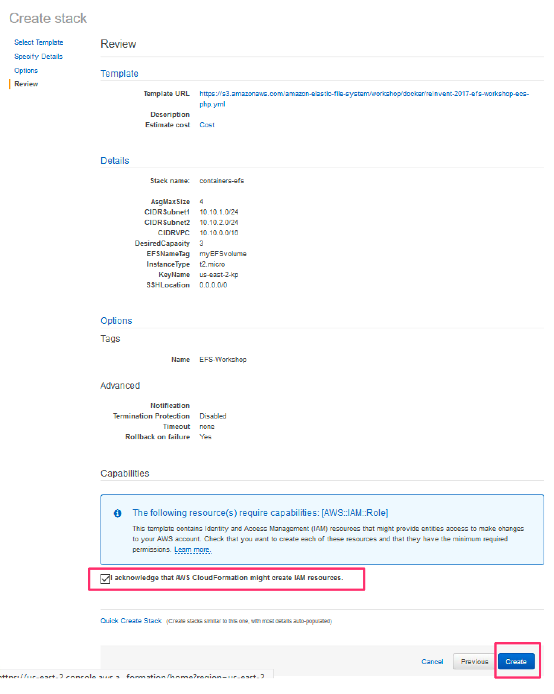

10.  Click Create. This stack will take about 10 minutes to create.

11.  The status will say **CREATE_IN_PROGRESS**. Once complete, the status will
    be **CREATE_COMPLETE**.

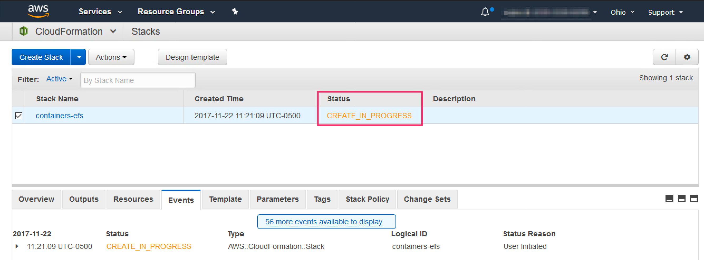

**Figure 1. Stack creation in progress.**

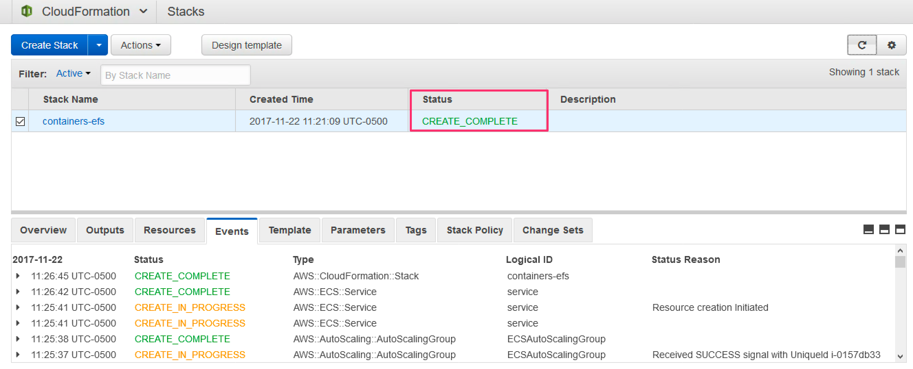

**Figure 2. Stack creation complete.**

While the lab is building, let’s preview what will happen next. Upon stack
completion, several Apache containers will be running. The Apache root directory
will be mapped to an EFS volume. The volume will be empty so when you
visit the site, you will see a HTTP error. To fix that, you will add a simple
*index.php* file and the Apache containers will serve that. If you change the
contents of *index.php*, the changes are visible to all containers immediately.

Explore the lab
===============

Proceed once the stack status says **CREATE_COMPLETE.**

1.  The CloudFormation template created the EFS filesystem and mounted it on
    the EC2 container instances. But how do the containers gain access to the
    EFS filesystem? Let’s look at the linkage between the containers and EFS.
    [Go to the ECS
    page](https://us-east-2.console.aws.amazon.com/ecs/home?region=us-east-2#/clusters)
    and click on your ECS cluster. Your cluster name should look something like
    this.

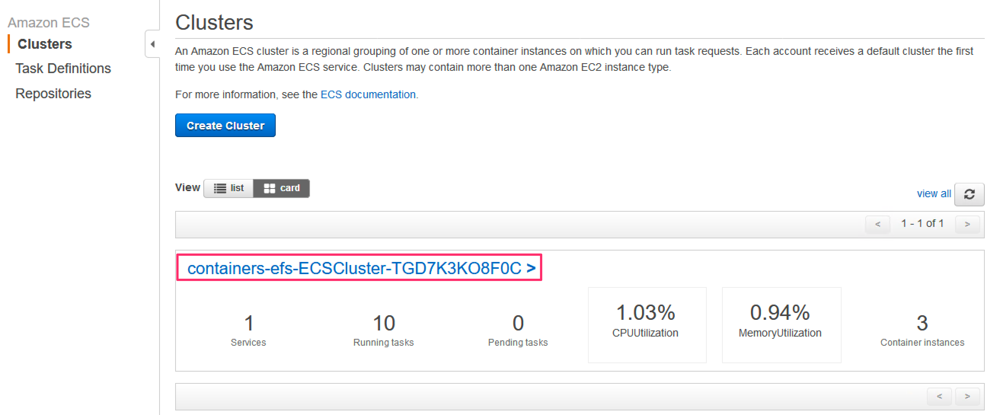

2.  The cluster details should show 10 containers running. You can view the
    running containers by clicking on the **Tasks** tab. Click on the
    **Task Definition** to view the details of the container configuration.

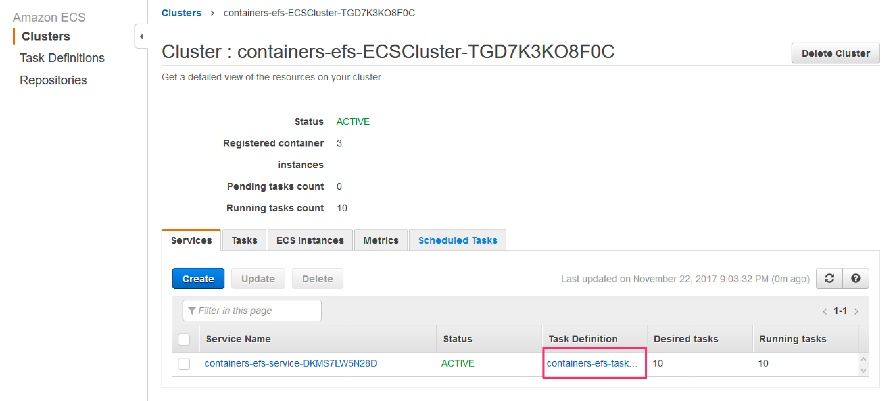

3.  In the **Builder** view, the Volumes section will show that there’s a volume
    available to the containers called *my-efs*. This volume is mounted on the
    EC2 container instances at /mnt/efs/php.

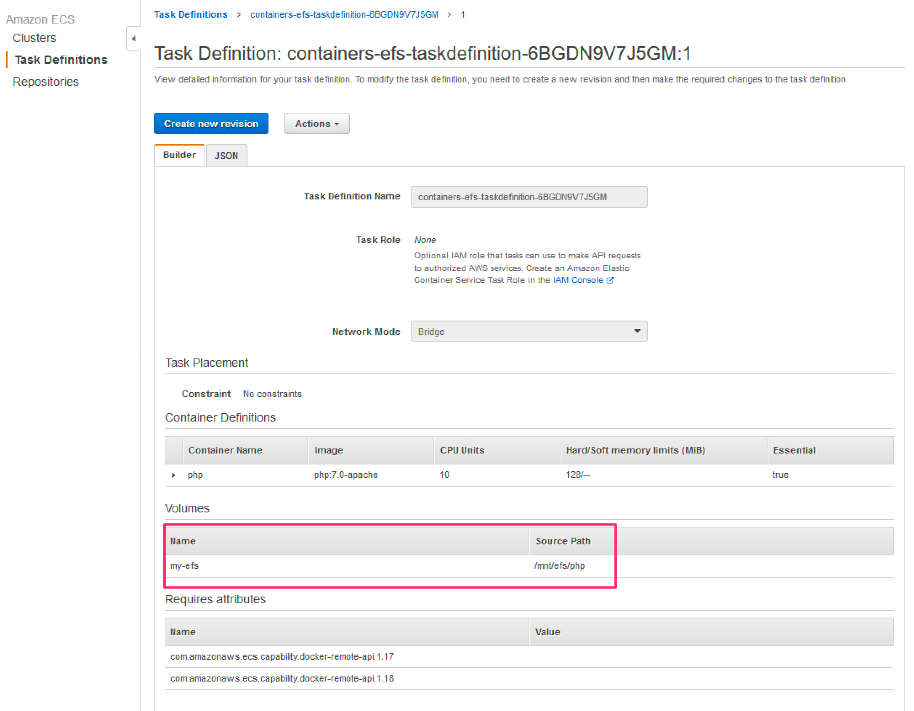

4.  In the JSON view, we can see that on the containers, the **my-efs** volume is
    mounted to **/var/www/html**, the default Apache home directory. Intitially this directory is empty.
```
   "mountPoints": [
    {
        "readOnly": null,
        "containerPath": "/var/www/html",
        "sourceVolume": "my-efs"
    }
],
```
Near the bottom of the JSON task definition, you can see the definition of the
**my-efs** volume.
```
    "volumes": [
    {
        "name": "my-efs",
        "host": {
        "sourcePath": "/mnt/efs/php"
        }
    }
]
```

And that’s how the containers are configured to use EFS. If you’re interested in
learning how EFS was initially created and mounted on the underlying EC2
instances, review the [CloudFormation template](https://github.com/aws-samples/amazon-efs-workshop/blob/c226a06bed6b5699caeebd4954b5405f1db59e04/scenarios/docker/reInvent-2017-efs-workshop-ecs-php.yml#L415), or once you connect to an instance (see below), view the file `/etc/fstab` to see how EFS is mounted on the instance.

5.  Now let’s access the Apache containers. [Go to the CloudFormation
    page](https://us-east-2.console.aws.amazon.com/cloudformation/home?region=us-east-2#/stacks?filter=active&tab=template),
    select our stack and click on the Outputs tab. It will display a link to the
    load balancer that fronts all the Apache containers. Click on the link.

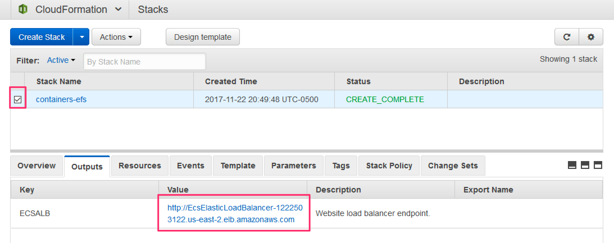

6.  When your browser visits the link, you will see the error “*502 Bad
    Gateway*” or *“503 Service Temporarily Unavailable”*. This is because the
    EFS directory used as the root directory by the Apache containers is empty.
    Apache can’t find a root document, so it displays an error. Let’s fix this
    by connecting to an EC2 instance and adding a index.php file to the EFS
    directory.

7.  [From the EC2
    page](https://us-east-2.console.aws.amazon.com/ec2/v2/home?region=us-east-2#Instances:sort=instanceId),
    select any one of the EC2 instance launched by our CloudFormation template.
    Copy the public DNS of the instance.

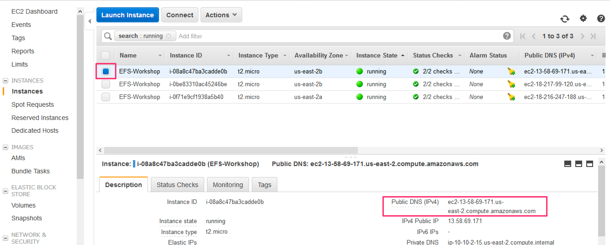

8.  SSH to the instance.
    1. Be sure to substitute the path to your PEM file (the one that was
        downloaded earlier when you created your keypair). Preface the hostname
        with **ec2-user\@.** For Mac and Linux users, the command should look
        similar to this:
    ```   
    ssh -i us-east-2-kp.pem ec2-user@ec2-13-58-69-171.us-east-2.compute.amazonaws.com
    ```
    2. For Windows users, follow the instructions for your preferred SSH app. If you don’t have a SSH app, [see this
    page](http://docs.aws.amazon.com/AWSEC2/latest/UserGuide/putty.html).


9. Once connected to an instance, we will download a *index.php* file to the
    */mnt/efs/php* directory that Apache can serve. Copy and paste the following lines into your SSH session.
    ```
    cd /mnt/efs/php
    sudo curl -O https://s3.amazonaws.com/amazon-elastic-file-system/workshop/docker/index.php
    sudo curl -O https://s3.amazonaws.com/amazon-elastic-file-system/workshop/docker/master.css
    ```

10.  Navigate to the load balancer page again and you should see something like
    this.

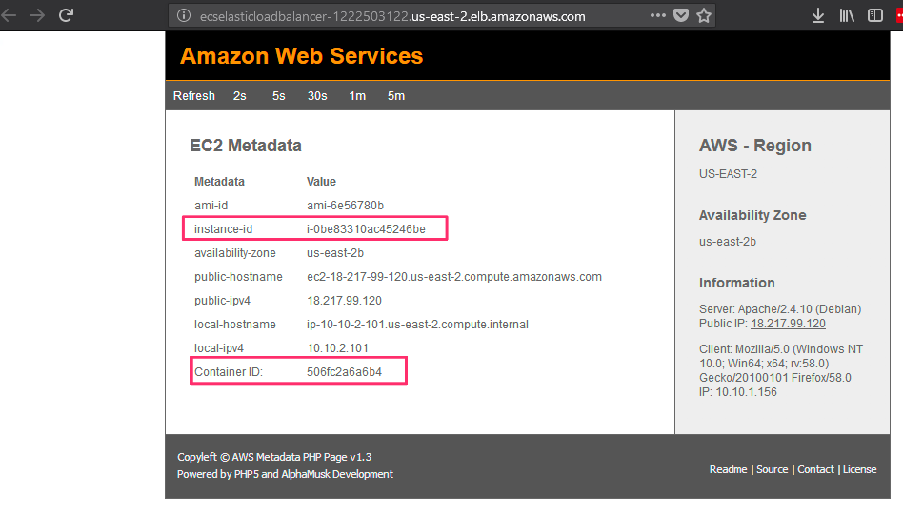

By manually refreshing the page or setting it to automatically refresh, you can
observe that the instance-id and container-id will change. This demonstrates
that requests are being served by multiple containers running on different
instances, all sharing a single EFS file system.  If you were to make a change to index.php or master.css, that change would be available to all containers instantly.  In practice, production containers are embedded with
the code they need but the goal of this lab was to demonstrate how easy it is to integrate EFS and ECS (or with any other type of container environment).

Conclusion
==========

As you saw, EFS makes it simple to share data amongst multiple containers.
In this lab, the containers only read data from EFS but obviously they also could have
easily written data to EFS.  Containers can also produce valuable
data that needs to be persisted beyond the lifetime of the container. EFS is a
reliable option for containers to store that data.

Delete the CloudFormation Stack
===============================

Once you’re done with this lab, be sure to delete it. You can do this easily via
the **Delete Stack** action in the [CloudFormation
page](https://us-east-2.console.aws.amazon.com/cloudformation/home?region=us-east-2#/stacks?filter=active&tab=outputs).


---
## Next Scenarios
### Click on the link below to pick a scenario

| Tutorial | Link
| --- | ---
| **Scenarios** | [](https://github.com/aws-samples/amazon-efs-workshop#section-2-scenarios) |

---
