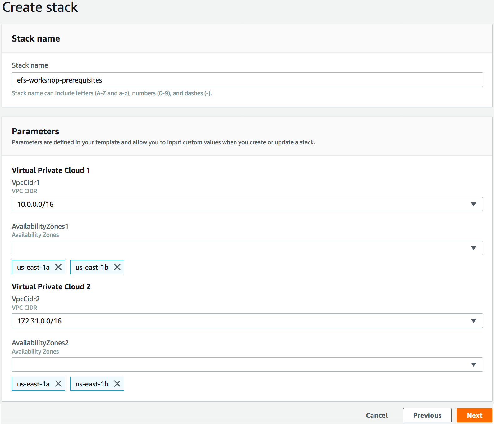

# **Amazon Elastic File System (Amazon EFS)**

## Prerequisites

### Version 2018.11

efs.wrkshp.2018.11

---

© 2018 Amazon Web Services, Inc. and its affiliates. All rights reserved. This work may not be  reproduced or redistributed, in whole or in part, without prior written permission from Amazon Web Services, Inc. Commercial copying, lending, or selling is prohibited.

Errors or corrections? Email us at [darrylo@amazon.com](mailto:darrylo@amazon.com).

---

## Overview

This section is designed to create two Amazon VPCs for subsequent workshop sections which are designed to help you better understand the distributed data storage design of Amazon Elastic File System (Amazon EFS) and how to best leverage this design by taking advantage of scale-out achitectures.

### Prerequisites

* An AWS account with administrative level access
* An Amazon EC2 key pair

If a key pair has not been previously created in your account, please refer to [Creating a Key Pair Using Amazon EC2](http://docs.aws.amazon.com/AWSEC2/latest/UserGuide/ec2-key-pairs.html#having-ec2-create-your-key-pair) from the AWS EC2 User's Guide.  

Verify that the key pair is created in the same AWS region you will use for the workshop.

WARNING!! This workshop environment will exceed your free-usage tier. You will incur charges as a result of building this environment and executing the scripts included in this workshop. Delete all AWS resources created during this workshop so you don’t continue to incur additional compute and storage charges.

### Create Amazon Virtual Private Clouds (Amazon VPCs)

Click on the link below in the desired AWS region to create the AWS Cloudformation stack that will create two Amazon VPCs in your AWS account. These VPCs will host Amazon EFS file systems and the other AWS resources created in this workshop. Use the following parameters and the screenshot below as a guide to enter the appropriate AWS CloudFormation parameter values.

#### Parameters

- Select two unique CIDR blocks, one per VPC (default recommended)

- Select two (2) Availability Zones per VPC

---

Click on the link below in the desired AWS region to create the AWS Cloudformation stack that will create two Amazon VPCs in your AWS account. 

| AWS Region Code | Region Name |
| :--- | :--- 
| us-east-1 | [US East (N. Virginia)](https://console.aws.amazon.com/cloudformation/home?region=us-east-1#/stacks/new?stackName=efs-workshop-prerequisites&templateURL=https://s3.amazonaws.com/aws-us-east-1/amazon-efs-workshop/templates/reinvent2018_efs_workshop_prerequisites.yaml) |
| us-east-2 | [US East (Ohio)](https://console.aws.amazon.com/cloudformation/home?region=us-east-2#/stacks/new?stackName=efs-workshop-prerequisites&templateURL=https://s3.amazonaws.com/aws-us-east-1/amazon-efs-workshop/templates/reinvent2018_efs_workshop_prerequisites.yaml) |
| us-west-1 | [US West (N. California)](https://console.aws.amazon.com/cloudformation/home?region=us-west-1#/stacks/new?stackName=efs-workshop-prerequisites&templateURL=https://s3.amazonaws.com/aws-us-east-1/amazon-efs-workshop/templates/reinvent2018_efs_workshop_prerequisites.yaml) |
| us-west-2 | [US West (Oregon)](https://console.aws.amazon.com/cloudformation/home?region=us-west-2#/stacks/new?stackName=efs-workshop-prerequisites&templateURL=https://s3.amazonaws.com/aws-us-east-1/amazon-efs-workshop/templates/reinvent2018_efs_workshop_prerequisites.yaml) |
| ap-northeast-2 | [Asia Pacific (Seoul)](https://console.aws.amazon.com/cloudformation/home?region=ap-northeast-2#/stacks/new?stackName=efs-workshop-prerequisites&templateURL=https://s3.amazonaws.com/aws-us-east-1/amazon-efs-workshop/templates/reinvent2018_efs_workshop_prerequisites.yaml) |
| ap-southeast-1 | [Asia Pacific (Singapore)](https://console.aws.amazon.com/cloudformation/home?region=ap-southeast-1#/stacks/new?stackName=efs-workshop-prerequisites&templateURL=https://s3.amazonaws.com/aws-us-east-1/amazon-efs-workshop/templates/reinvent2018_efs_workshop_prerequisites.yaml) |
| ap-southeast-2 | [Asia Pacific (Sydney)](https://console.aws.amazon.com/cloudformation/home?region=ap-southeast-2#/stacks/new?stackName=efs-workshop-prerequisites&templateURL=https://s3.amazonaws.com/aws-us-east-1/amazon-efs-workshop/templates/reinvent2018_efs_workshop_prerequisites.yaml) |
| ap-northeast-1 | [Asia Pacific (Tokyo)](https://console.aws.amazon.com/cloudformation/home?region=ap-northeast-1#/stacks/new?stackName=efs-workshop-prerequisites&templateURL=https://s3.amazonaws.com/aws-us-east-1/amazon-efs-workshop/templates/reinvent2018_efs_workshop_prerequisites.yaml) |
| eu-central-1 | [EU Central (Frankfurt)](https://console.aws.amazon.com/cloudformation/home?region=eu-central-1#/stacks/new?stackName=efs-workshop-prerequisites&templateURL=https://s3.amazonaws.com/aws-us-east-1/amazon-efs-workshop/templates/reinvent2018_efs_workshop_prerequisites.yaml) |
| eu-west-1 | [EU East (Ireland)](https://console.aws.amazon.com/cloudformation/home?region=eu-west-1#/stacks/new?stackName=efs-workshop-prerequisites&templateURL=https://s3.amazonaws.com/aws-us-east-1/amazon-efs-workshop/templates/reinvent2018_efs_workshop_prerequisites.yaml) |

---
## Next section
### Click on the link below to go to the next Amazon EFS workshop section

| [**Create**](/workshop/1-create) |
| :---
---

For feedback, suggestions, or corrections, please email me at [darrylo@amazon.com](mailto:darrylo@amazon.com).

## License Summary

This sample code is made available under a modified MIT license. See the LICENSE file.

